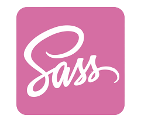
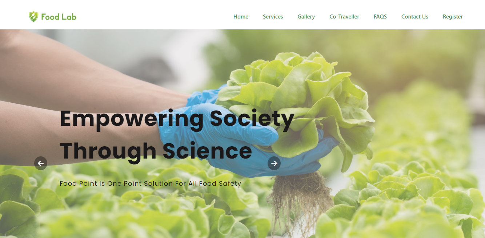
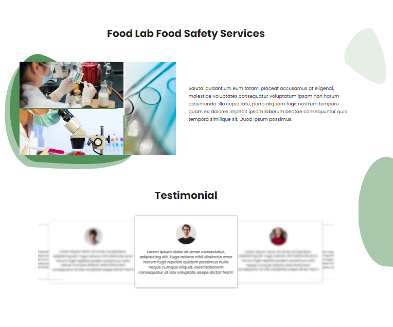
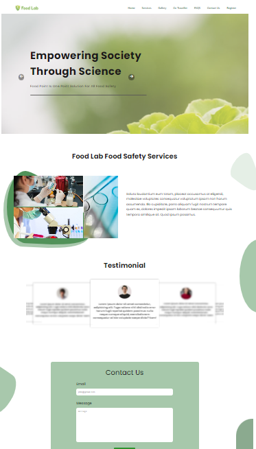

# Food-lab landing page

## tools and technologies used

### this is a entirely responsive food lab landing page 

## screenshot's here

### [Check now](https://nidhisharma63.github.io/food-lab/).

